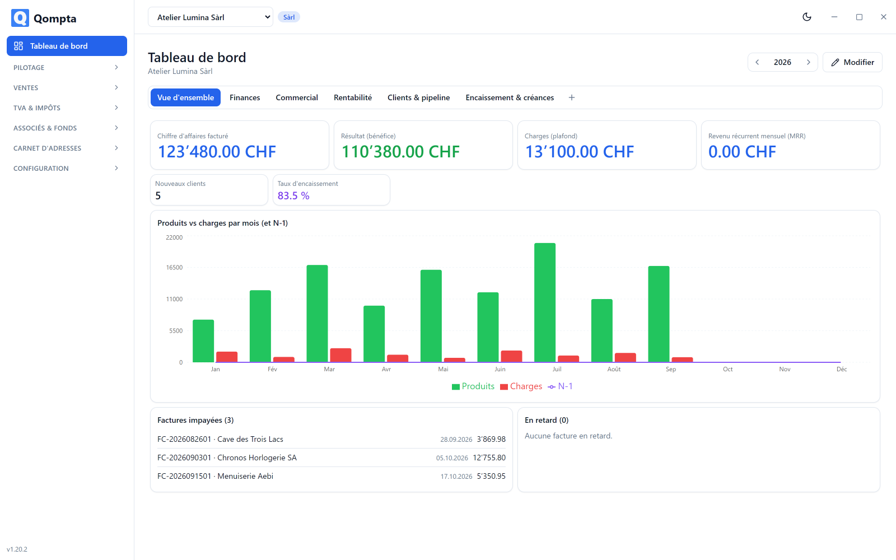
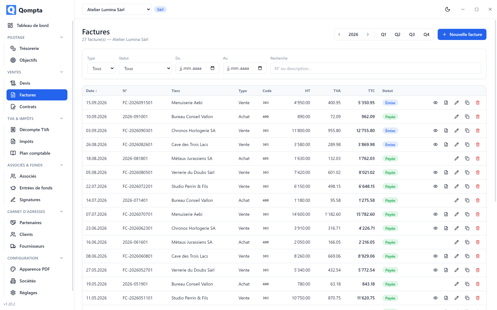
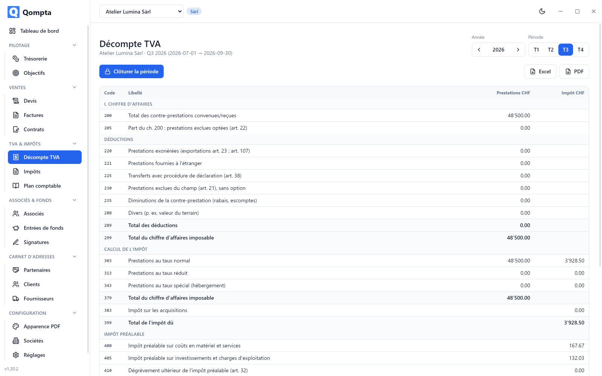
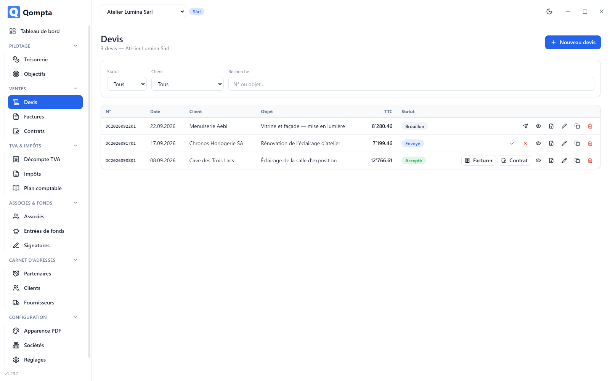
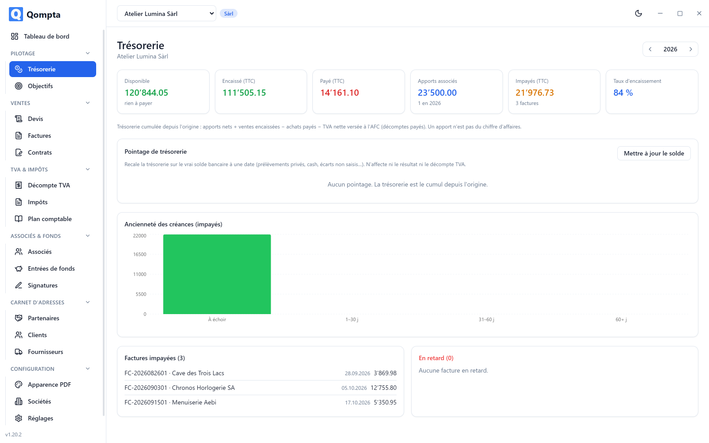

<div align="center">


# Qompta

**Swiss multi-company accounting and VAT, fully local, fully encrypted.**

Desktop application that keeps the books of several Swiss companies, prepares the FTA
VAT return and covers the commercial cycle quote → contract → invoice, Swiss QR-bill
included. No data ever leaves your machine.

<sub>The application interface is in French. This README and the technical documentation are in English.</sub>

[](https://github.com/aekainal/qompta/releases/latest)
[](LICENSE)
[](https://github.com/aekainal/qompta/releases/latest)
[](https://github.com/aekainal/qompta/releases/latest)

[](https://www.electronjs.org/)
[](https://www.typescriptlang.org/)
[](https://react.dev/)
[](https://www.sqlite.org/)

**[⬇ Download the latest version](https://github.com/aekainal/qompta/releases/latest)**

</div>

---

## 📸 Overview

<div align="center">



<em>Customisable dashboard: draggable and resizable widgets, KPIs and charts.</em>

</div>

<table>
<tr>
<td width="50%"><br><em>Invoices: filters by VAT period, statuses, service line detail.</em></td>
<td width="50%"><br><em>VAT return pre-filled in the format of the FTA form.</em></td>
</tr>
<tr>
<td width="50%"><br><em>Quotes: sections, service lines, status from draft to invoiced.</em></td>
<td width="50%"><br><em>Cash position: payments received, shareholder contributions, bank reconciliation.</em></td>
</tr>
</table>


---

## ✨ What Qompta does

### 🏢 Several companies, several legal forms

Sole proprietorship, simple partnership, general partnership, Sàrl, SA, association. Each
company is **strictly compartmentalised**: isolation is enforced by automated tests, not
by convention alone. A company can **change legal form** along the way: the books switch
to double-entry accounting and the chart of accounts is completed, without losing any
history.

### 🧾 FTA VAT return

The return is **pre-filled from the invoices**, using the official codes 200 → 910,
effective method or net tax debt rate. A draft invoice is excluded from it: VAT is only
due once the invoice is issued. Closing, history, PDF and Excel export.

Amounts are stored **as whole cents** and rates **in basis points** (8.10 % = 810): no
floating-point number ever touches an amount, so no cent evaporates in rounding.

### 📄 Quote → contract → invoice

Numbering `DC` / `FC` / `CC`, reset daily and per company. A quote never touches the VAT
return; it is its conversion that creates the invoice, which enters the return once
issued. Contracts are composed **from sections** (10 block types, 8 starting structures)
with variables frozen when the contract is saved.

### 🇨🇭 Swiss QR-bill

Generated in the standard 210 × 105 mm format, with a validated IBAN and a QR reference
derived automatically for a QR-IBAN. It **always closes the last page**, even when the
service line detail spills over several pages.

### 🔒 End-to-end encryption

The database lives **in memory**; only a file sealed with **AES-256-GCM** ever touches
the disk. The key is shown to you **only once**, as a recovery key; on the machine it is
only kept wrapped by your **login password** (Argon2id) and, if you want, by **Windows
Hello** (face, fingerprint, PIN). Nothing opens without logging in, and a forgotten
password can only be replaced with the recovery key. Automatic backups are encrypted too.

### 📊 Dashboards and targets

Several dashboards per company, widgets draggable and resizable on a free-form grid, 22
metrics available as KPIs and a catalogue of charts, plus custom charts. Management
targets tracked in real time: never stored, always recomputed from the data.

### ↩️ Nothing is irreversible

No blocking dialog boxes. Deletions are **deferred by 5 seconds** and can be cancelled,
changes can be **undone after the fact**, and closing a form you were filling in offers
to **resume** it.

---

## ⬇️ Installation

> 🇫🇷 **[Guide d'installation →](docs/fr/INSTALLATION.md)** · **[Guide d'utilisation →](docs/fr/GUIDE.md)**
>
> User documentation follows the application, which is in French. English and German are planned.

Packages can be downloaded from the **[releases page](https://github.com/aekainal/qompta/releases/latest)**.

### Windows 64-bit

1. Download `Qompta-<version>-setup.exe`.
2. Run it. The installer does **not** require administrator rights and lets you choose the
   installation folder.
3. Windows SmartScreen may show a warning: the installer is not signed with a commercial
   certificate. Click **More info** → **Run anyway**.

### Linux (Debian, Ubuntu and derivatives)

```bash
sudo apt install ./Qompta-<version>.deb
```

`apt` installs the required libraries along the way. With `dpkg -i`, you have to complete
the install by hand with `sudo apt-get install -f`.

> **Other distributions**: an AppImage is published as well. Make it executable
> (`chmod +x Qompta-<version>.AppImage`) and run it, with no installation.

### 🔑 On first launch: read this before clicking

Qompta encrypts your data and shows you **only once** a recovery key of the form
`QK1-XXXX-XXXX-…`, then asks for a login password.

**Write it down and keep it somewhere other than this computer.** It is the only way to
reopen your data if the machine becomes inaccessible, and to replace a forgotten password. No
one can regenerate it: neither you, nor the author of the software.

---

## 🛠️ Building from source

### Prerequisites

**Node 22 LTS**; an [`.nvmrc`](.nvmrc) file is provided. Node 22 has prebuilt binaries
for `better-sqlite3`: no compiler is needed.

```bash
nvm install && nvm use     # reads .nvmrc → Node 22
npm install
```

### Running in development

```bash
npm run dev
```

> On Linux, the interface needs Electron's system libraries:
> `sudo apt-get install -y libnss3 libnspr4 libasound2 libgtk-3-0 libgbm1`

### Building the packages

Each installer is built **on its own system**: electron-builder does not produce a `.exe`
from Linux.

```bash
npm run build:win      # Windows → release/Qompta-<version>-setup.exe
npm run pack:linux     # Linux   → release/Qompta-<version>.deb + .AppImage
npm run build:mac      # macOS   → release/Qompta-<version>.dmg
```

> **Native module**: `better-sqlite3` comes in two incompatible builds, one for Node (the
> tests), the other for Electron (the application). The npm scripts rebuild the right one
> before each command. If the packaged application refuses to start, it is almost always
> this binary that is in the wrong build.

### Tests

```bash
npm test          # Vitest suite
npm run typecheck # strict TypeScript
npm run seed      # 4 demo companies
```

---

## 📚 Code documentation

The business core (VAT, tax, amounts) lives in `src/shared/` as **pure functions**,
with no dependency on Electron or on the database. That is what makes it testable and
verifiable in isolation.

```
src/
├─ main/      Electron process: window, IPC, encrypted database, backups, undo
├─ preload/   contextIsolation bridge → window.api (typed IPC)
├─ renderer/  React 18 + Tailwind application
├─ shared/    PURE business core: VAT, tax, amounts (testable without Electron)
└─ db/        Drizzle schema, migrations, repositories (isolation by company_id)
```

The renderer **never** accesses the database: everything goes through a typed IPC layer
(`src/shared/ipc.ts`), with `contextIsolation` enabled and `nodeIntegration` disabled.

The detailed technical documentation is in English in [`docs/`](docs/):

| Document | Contents |
|---|---|
| [`fr/INSTALLATION.md`](docs/fr/INSTALLATION.md) | Installing on Windows and Linux, the recovery key, backups (**in French**) |
| [`fr/GUIDE.md`](docs/fr/GUIDE.md) | Using the application, screen by screen (**in French**) |
| [`ARCHITECTURE.md`](docs/ARCHITECTURE.md) | Processes, IPC, security, PDF generation pipeline |
| [`DATA-MODEL.md`](docs/DATA-MODEL.md) | All tables, columns and relations |
| [`VAT-LOGIC.md`](docs/VAT-LOGIC.md) | FTA VAT return codes and calculation rules |
| [`ROADMAP.md`](docs/ROADMAP.md) | Milestones delivered, from M0 to M24 |

---

## 📄 License

**Apache License 2.0, supplemented by the [Commons Clause](https://commonsclause.com/).**
Full text in [`LICENSE`](LICENSE).

In summary (the `LICENSE` file alone is authoritative):

| | |
|---|---|
| ✅ | Use Qompta, including within a business to keep its own books |
| ✅ | Copy, modify, fork and redistribute the software |
| ❌ | **Sell** Qompta, or sell a service whose value derives substantially from it |

This restriction makes the licence *source available* rather than open source in the OSI
sense, which allows no limit on commercial use. It is a deliberate choice.

For commercial use beyond that scope, a separate licence can be negotiated:
**contact@qwasar.ch**

The name "Qompta" and the associated brand elements are not granted by the licence.

---

<div align="center">
<sub>© 2026 Qwasar Gerber RI · made in Switzerland 🇨🇭</sub>
</div>
