# Guide d'utilisation de Qompta

Ce guide parcourt l'application dans l'ordre où vous la rencontrez réellement : créer
une société, tenir son carnet d'adresses, vendre, acheter, déclarer la TVA, suivre la
trésorerie.

Les captures utilisent une société fictive, **Atelier Lumina Sàrl**, un atelier
d'éclairage à Neuchâtel.

Pour installer l'application et comprendre la clé de récupération, voyez
[INSTALLATION.md](INSTALLATION.md).

## Sommaire

1. [Créer une société](#1-créer-une-société)
2. [Le carnet d'adresses](#2-le-carnet-dadresses)
3. [Le plan comptable](#3-le-plan-comptable)
4. [Les devis](#4-les-devis)
5. [Les contrats](#5-les-contrats)
6. [Les factures](#6-les-factures)
7. [Le décompte TVA](#7-le-décompte-tva)
8. [Le dossier fiscal](#8-le-dossier-fiscal)
9. [La trésorerie](#9-la-trésorerie)
10. [Associés et entrées de fonds](#10-associés-et-entrées-de-fonds)
11. [Les signatures](#11-les-signatures)
12. [Les tableaux de bord](#12-les-tableaux-de-bord)
13. [Les objectifs](#13-les-objectifs)
14. [L'apparence des documents](#14-lapparence-des-documents)
15. [Plusieurs sociétés](#15-plusieurs-sociétés)
16. [Réglages et sauvegardes](#16-réglages-et-sauvegardes)
17. [Rien n'est irréversible](#17-rien-nest-irréversible)

---

## 1. Créer une société

À la première ouverture, l'application est vide et vous invite à créer une société.
Vous la retrouverez toujours sous **Configuration → Sociétés**.

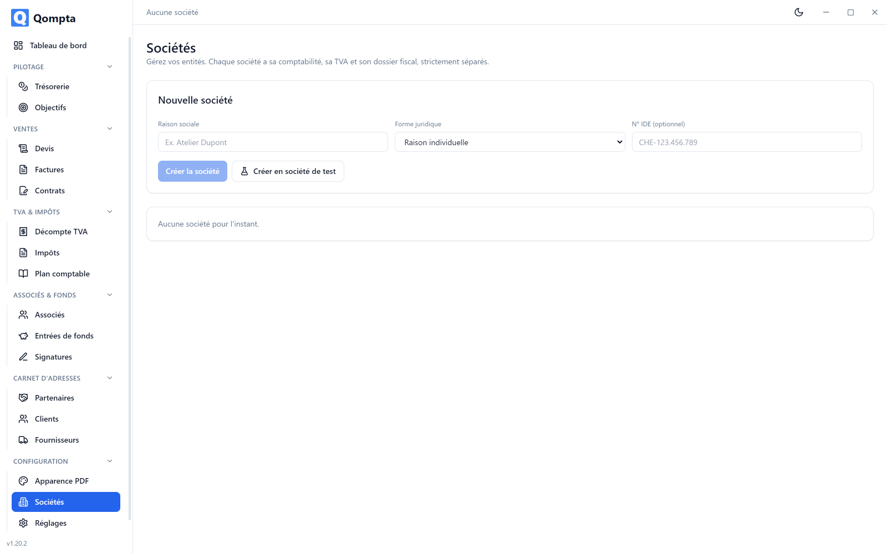

Cliquez sur **« Nouvelle société »**. Le formulaire s'ouvre directement dans la page.

### La forme juridique commande tout le reste

C'est le seul choix vraiment structurant : il décide de la comptabilité et de la
fiscalité appliquées ensuite.

| Forme juridique | Comptabilité | Imposition |
|---|---|---|
| Raison individuelle | simple | sur le revenu du titulaire |
| Société simple, SNC | simple | sur la part de chaque associé |
| Sàrl, SA | double | sur le **bénéfice et le capital** |
| Association | simple | sur le bénéfice seul, sans capital |

Les autres champs (IDE, n° TVA, adresse, contact) servent aux documents commerciaux.
Remplissez-les proprement : ils s'impriment sur vos devis et vos factures, et l'adresse
est indispensable à la QR-facture.

Le bouton **« Créer en société de test »** crée la même chose avec un nom préfixé
`TEST_`. Une société de test est **supprimable définitivement**, contrairement à une
société réelle qui ne peut qu'être archivée. C'est là qu'il faut faire ses essais.

### Changer de forme plus tard

Une raison individuelle qui devient une Sàrl, par exemple. Qompta bascule alors la
comptabilité en partie double, complète le plan comptable avec les comptes de capital
manquants, et **conserve l'historique** de ce que la société était avant.

### Les réglages TVA

Sous **TVA & impôts → Décompte TVA**, indiquez si la société est assujettie, selon
quelle méthode (effective, ou taux de la dette fiscale nette) et sur quelle période
(trimestrielle, semestrielle, annuelle). Ce choix commande les filtres des factures et
le décompte lui-même.

---

## 2. Le carnet d'adresses

Il se divise en **Clients**, **Fournisseurs** et **Partenaires**.

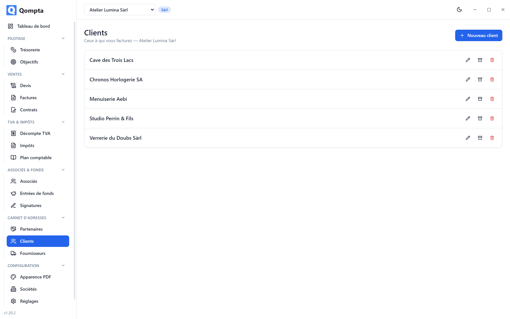

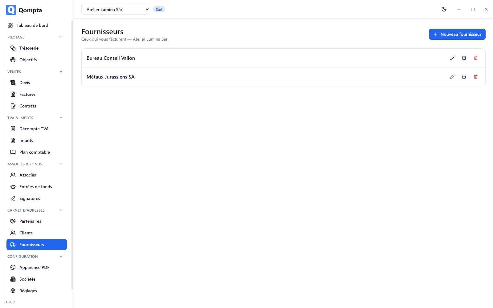

Le bouton **« Nouveau »** ouvre la fiche.

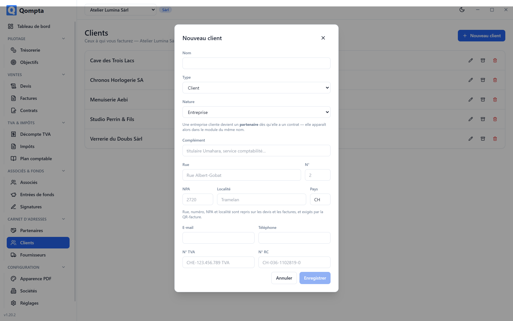

Un tiers peut être **client**, **fournisseur**, ou les deux. Distinguez aussi
l'**entreprise** de la **personne physique** : cela change la façon dont l'adresse
s'imprime.

> **Remplissez l'adresse complètement** pour tous ceux que vous facturez. La QR-facture
> suisse n'est valable qu'avec une adresse complète : rue, numéro, code postal, localité,
> pays.

### Les partenaires se déduisent

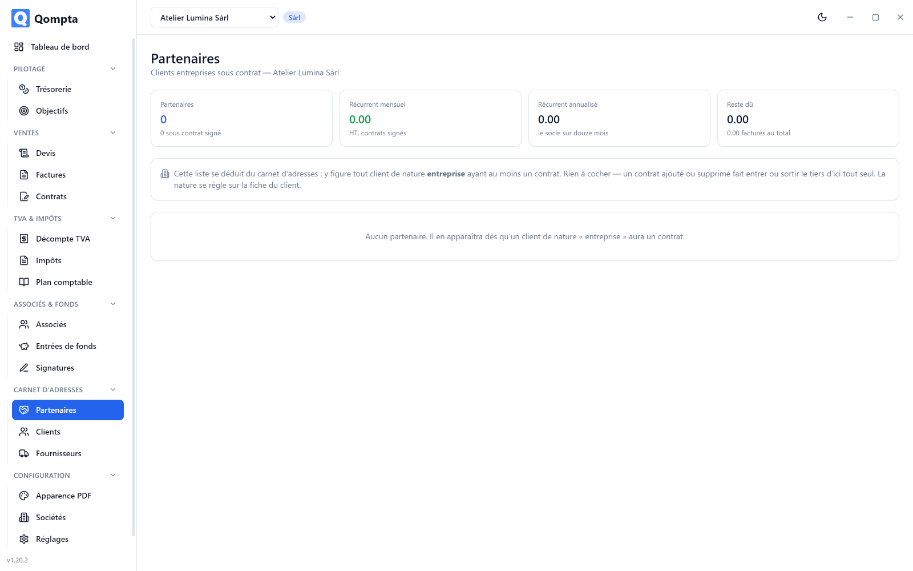

Il n'y a **pas de case à cocher** « partenaire ». Est partenaire tout client de type
entreprise qui a au moins un contrat. Signez un contrat, il apparaît ; supprimez le
contrat, il en sort. Un tiers archivé y reste : l'archivage ne raye pas un engagement.

### Supprimer un tiers

Un tiers sans aucun document lié peut être **supprimé définitivement**. Dès qu'il porte
une facture ou un devis, seul l'archivage est possible : l'historique comptable prime.

---

## 3. Le plan comptable

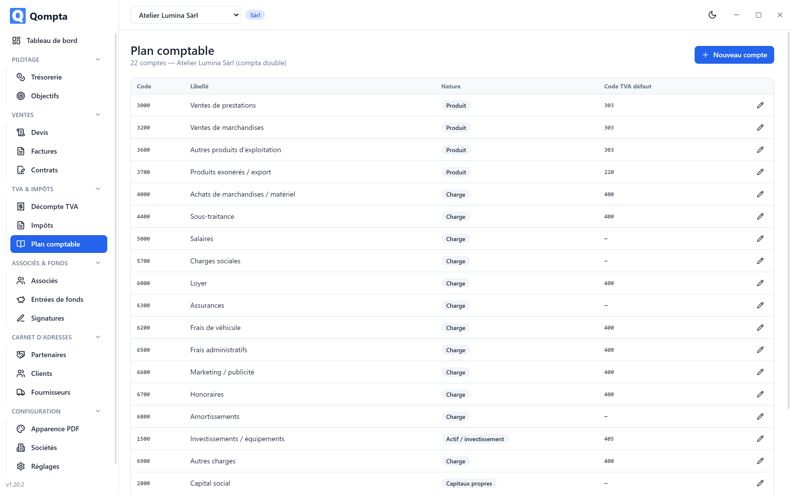

Chaque société reçoit un plan comptable adapté à sa forme juridique. Il sert à
catégoriser les factures, et alimente le dossier fiscal.

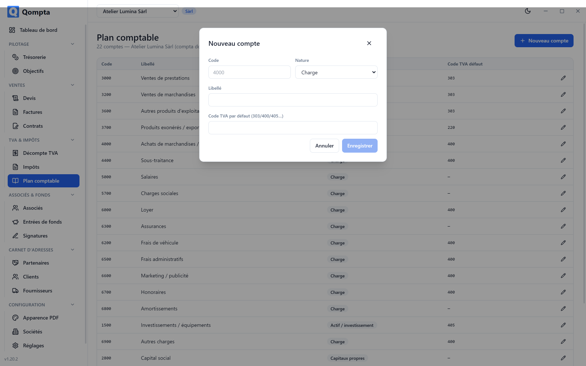

Un compte porte un **code**, un **libellé**, un **type** (produit, charge, actif,
passif, fonds propres) et éventuellement un **code TVA par défaut**, qui sera proposé
automatiquement sur les factures de cette catégorie. La case « investissement » range
la charge en code 405 du décompte plutôt qu'en 400.

---

## 4. Les devis

Un devis est un document **commercial** : il ne touche **jamais** le décompte TVA. Il
est numéroté `DC` suivi de la date et d'un compteur remis à zéro chaque jour.

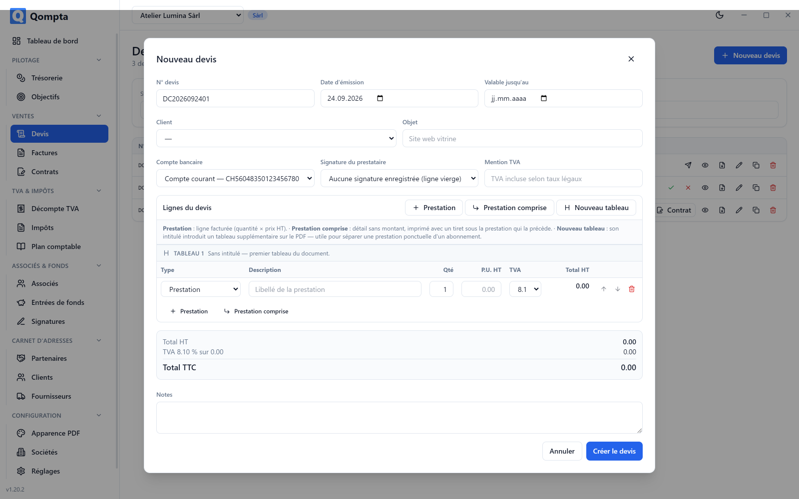

### Les trois sortes de lignes

| Sorte | Effet |
|---|---|
| **Section** | un titre, pour structurer un long devis |
| **Prestation** | une ligne facturée : quantité × prix HT |
| **Prestation comprise** | un détail imprimé avec un tiret, **sans montant** |

C'est ce qui permet de détailler une offre sans gonfler le total : « Installation
complète » facturée, et sous elle trois lignes qui disent ce que « complète » recouvre.

### Le cycle

1. **Brouillon** : vous rédigez.
2. **Envoyé** : le devis est parti chez le client.
3. **Accepté** : il a dit oui.
4. **Facturé** : un devis accepté se transforme en facture.

Un devis **refusé** puis retravaillé est relié à son remplaçant : il sort alors des
affaires perdues du tableau de bord, au lieu de compter deux fois.

### La conversion en facture

La conversion produit une facture de vente **en brouillon**, et **une facture par taux
de TVA** si le devis en mélange plusieurs. Ce découpage n'est pas une coquetterie : une
facture ne peut porter qu'un seul taux, sans quoi la ventilation 303/313/343 du décompte
serait fausse.

Un devis facturé n'est plus ni modifiable ni supprimable **tant que sa facture existe**.
Supprimez cette facture et le devis repasse **accepté** : de nouveau modifiable et
reconvertible.

---

## 5. Les contrats

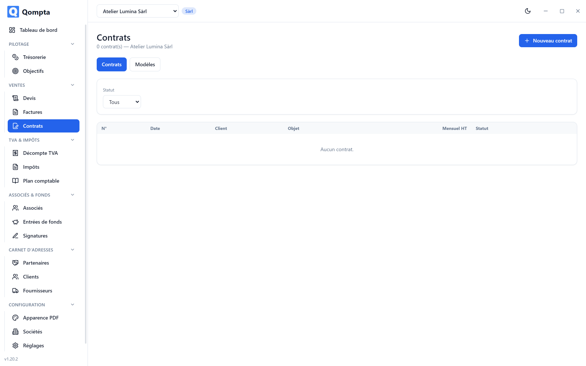

Un contrat se compose **par sections** : dix types de blocs, et huit structures de
départ (contrat de prestation, abonnement, mandat, contrat d'entreprise au forfait,
NDA…).

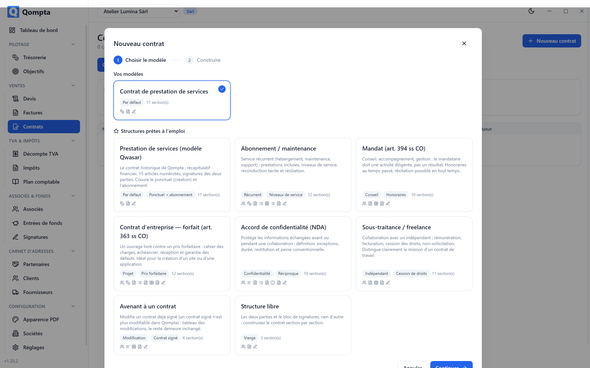

Pendant la saisie, les `{{variables}}` restent visibles. Elles sont **figées à
l'enregistrement** : choisissez donc le modèle **avant** de saisir les montants.

Un contrat couvre **tout le devis** : le montant ponctuel comme le récurrent. Seuls les
contrats **signés** comptent dans le chiffre d'affaires récurrent, mais tous restent
affichés : l'historique compte.

---

## 6. Les factures

Ventes et achats vivent dans la même liste, les plus récentes d'abord.

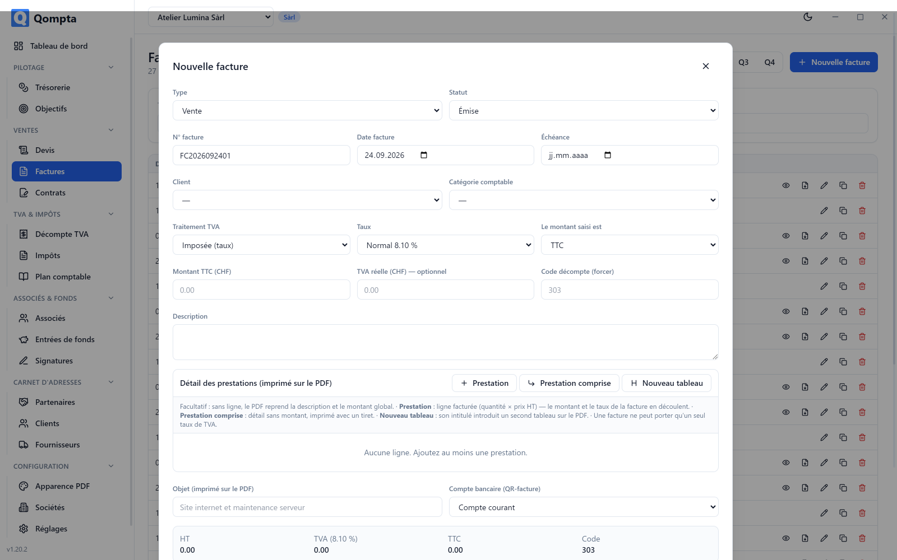

### Le statut décide de tout

| Statut | Entre au décompte TVA | Compte dans la trésorerie |
|---|---|---|
| **Brouillon** | non | non |
| **Émise** | oui | non |
| **Payée** | oui | oui |
| **En retard** | oui | non |
| **Réglé (pour TVA)** | oui | **non** |

Seul le brouillon reste hors du décompte : la TVA est due à l'**émission**, pas au
paiement.

Le dernier statut est le cas particulier. Il couvre une facture **réglée par un tiers**
(typiquement une autre de vos sociétés) mais enregistrée ici pour **récupérer la TVA**.
Elle entre au décompte et reste hors de la trésorerie, puisque aucun argent n'est entré
dans cette société-ci. Il n'est proposé qu'aux sociétés **assujetties**.

### Les filtres par période TVA

Les boutons à côté de l'année suivent la périodicité de la société : `T1…T4` au
trimestre, `S1/S2` au semestre, « Année » à l'année. Ils se **cumulent**, et
s'**ajoutent** aux filtres du dessous au lieu de les remplacer. Les flèches d'année
filtrent cette année-là à défaut de trimestre sélectionné.

### Le détail des prestations

Une facture peut porter des lignes comme un devis. Son montant et son taux découlent
alors de ces lignes, et elle n'accepte **qu'un seul taux de TVA**, pour la même raison
qu'un devis se découpe à la conversion. Sans ligne, elle reste une écriture au montant
global.

### La TVA réelle

Le champ « TVA réelle » permet de saisir le montant exact figurant sur une facture
fournisseur, quand il diffère du calcul théorique : un ancien taux à 7.7 %, un
arrondi différent. Le décompte reprend alors ce montant plutôt que le sien.

---

## 7. Le décompte TVA

L'écran reprend le formulaire officiel de l'AFC et le **pré-remplit depuis vos
factures**, aux vrais codes : chiffre d'affaires en 200, déductions en 220 à 280, impôt
calculé en 303/313/343, impôt préalable en 400 à 420.

Choisissez l'année et la période. Les chiffres sont **recalculés en direct** : rien
n'est stocké, donc une facture corrigée se répercute immédiatement.

### Clôturer

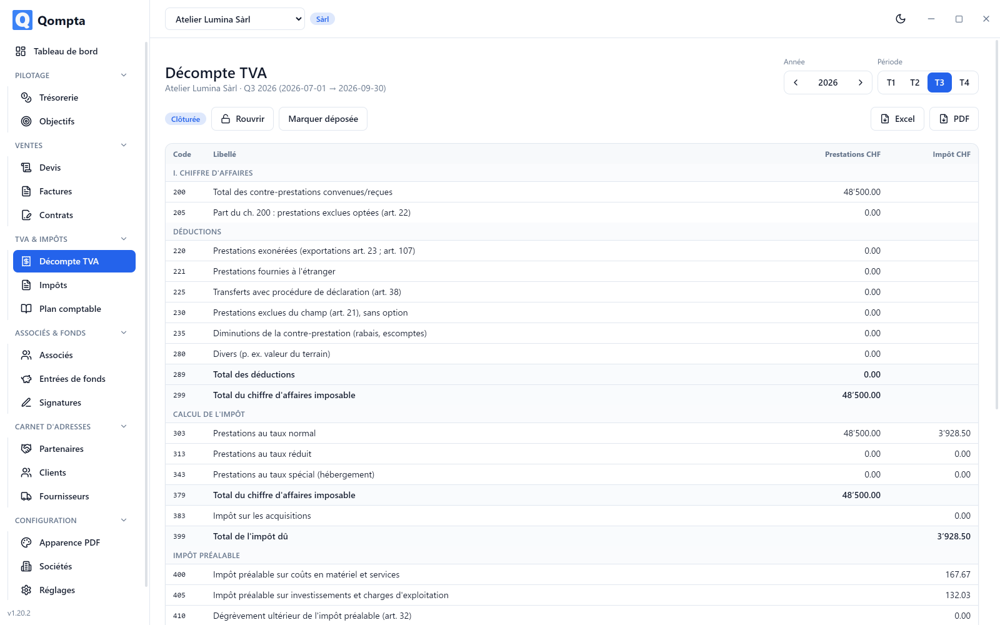

**« Clôturer la période »** archive le décompte comme déclaré et fige la période. Avant
cela, exportez-le en **PDF** ou en **Excel** pour recopier les montants dans le portail
de l'AFC.

Une fois le décompte payé, enregistrez le règlement : le montant sort alors de la
trésorerie. Un décompte TVA est la seule chose qui déplace de l'argent sans être ni une
vente ni un achat.

---

## 8. Le dossier fiscal

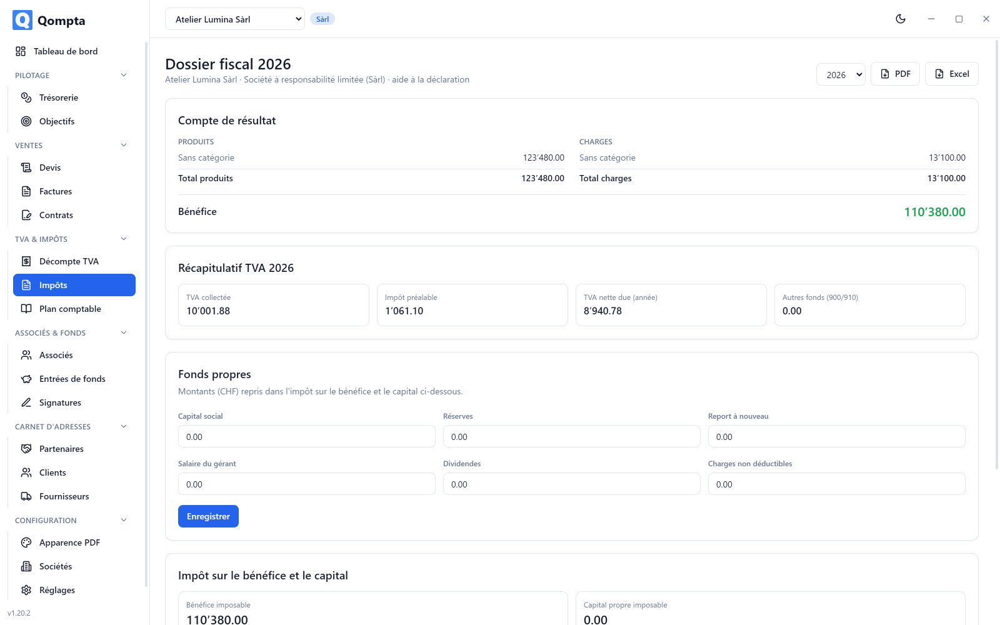

L'écran **Impôts** rassemble ce qu'il faut pour la déclaration, adapté à la forme
juridique : bénéfice imposable, et pour une Sàrl ou une SA, le capital.

Pour ces deux formes, les **fonds propres** se saisissent ici et alimentent le calcul de
l'impôt sur le bénéfice et sur le capital.

---

## 9. La trésorerie

La trésorerie est **cumulative depuis l'origine** : apports nets, plus ventes réellement
encaissées, moins achats réellement payés, moins la TVA nette versée à l'AFC. L'apport
de l'an dernier paie encore les factures de cette année. C'est pourquoi rien n'est
remis à zéro au changement d'exercice.

L'écran affiche aussi l'**ancienneté des créances** : ce qui est à échoir, et ce qui
traîne depuis 30, 60 ou plus de 60 jours.

### Recaler sur le vrai solde bancaire

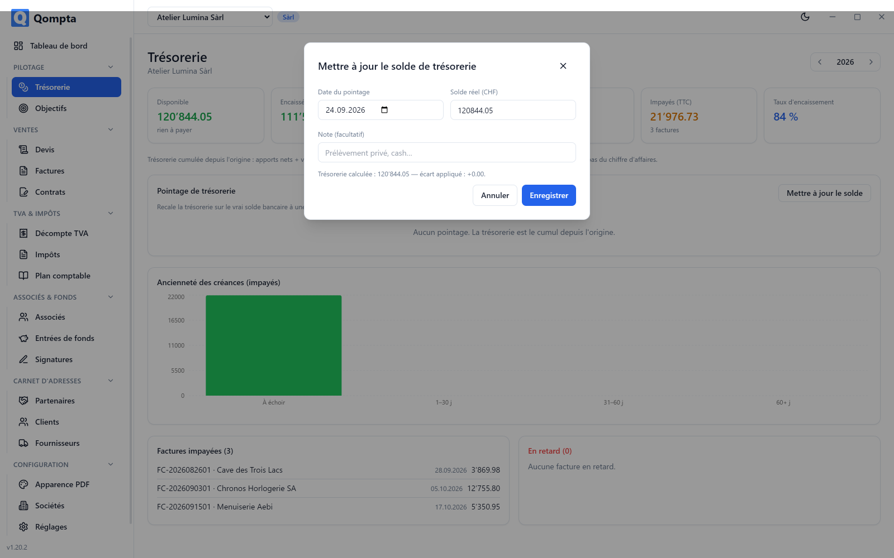

La réalité dérive : prélèvements privés, espèces, écarts jamais saisis.
**« Mettre à jour le solde »** enregistre le **solde bancaire réellement constaté** à
une date. À partir de là, la trésorerie affiche *ce solde, plus ce qui s'est passé
strictement après*.

Une écriture antérieure au pointage ne bouge donc plus la trésorerie présente. Elle
reste dans les listes, les rapports et le décompte TVA : le pointage n'affecte **ni le
résultat ni la TVA**.

---

## 10. Associés et entrées de fonds

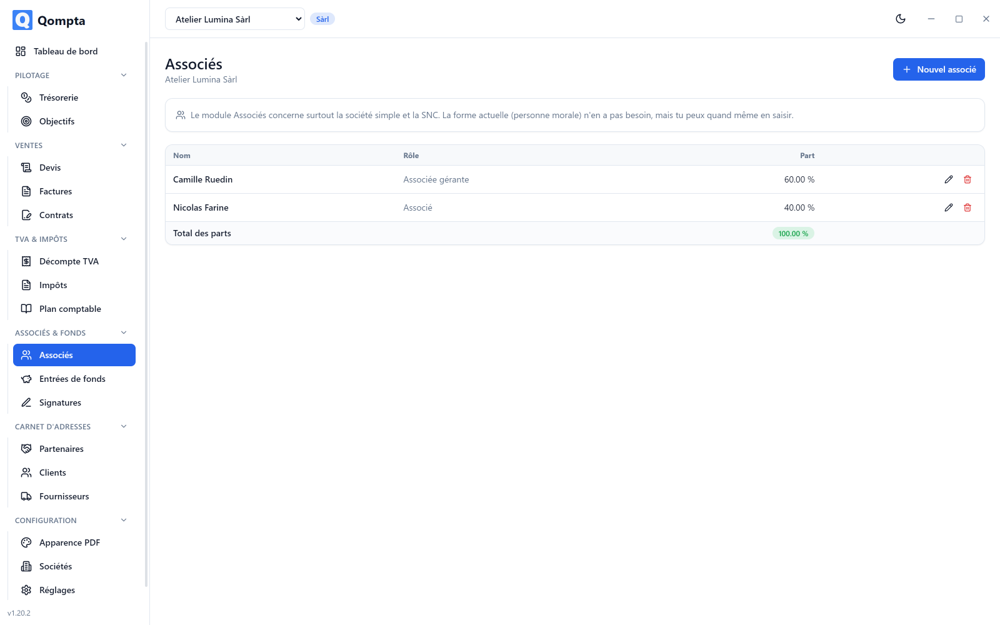

Les associés portent un **nom**, une **part** en pourcentage et un **rôle**. La part
sert à répartir le bénéfice dans les formes imposées sur les associés.

### Les entrées de fonds

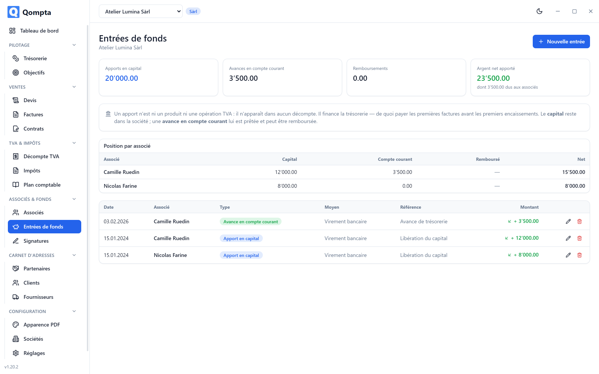

C'est l'argent qu'un associé verse dans la société. Une **table à part, exprès** : un
apport n'est ni un produit ni une opération TVA, et **aucun calcul de décompte ne le
lit**.

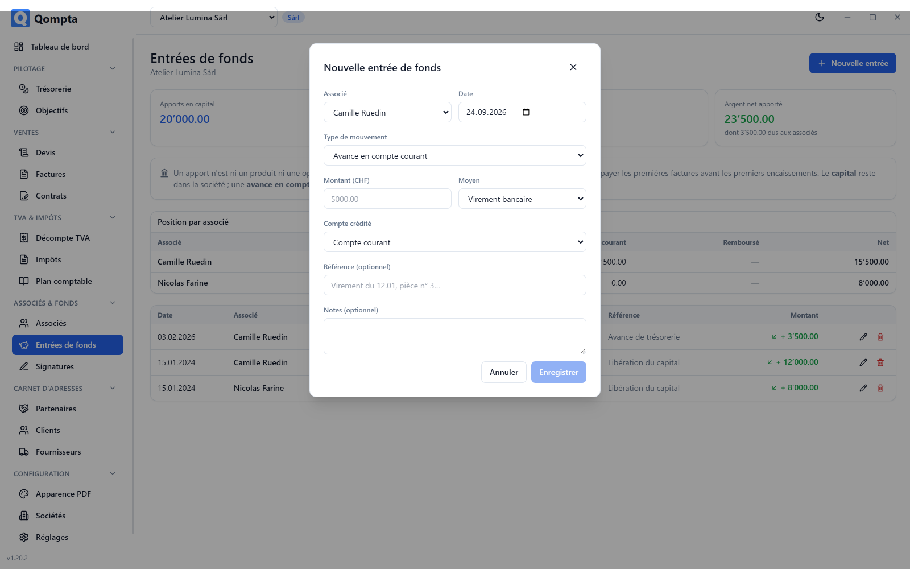

Trois natures :

| Nature | Sens |
|---|---|
| **Capital** | fonds propres, définitivement dans la société |
| **Compte courant** | avance remboursable, une dette envers l'associé |
| **Remboursement** | l'argent ressort |

Le montant reste **toujours positif** : c'est la nature qui porte le sens.

Le nom de l'associé est figé à la saisie : faire sortir un associé n'efface pas
l'historique du financement.

---

## 11. Les signatures

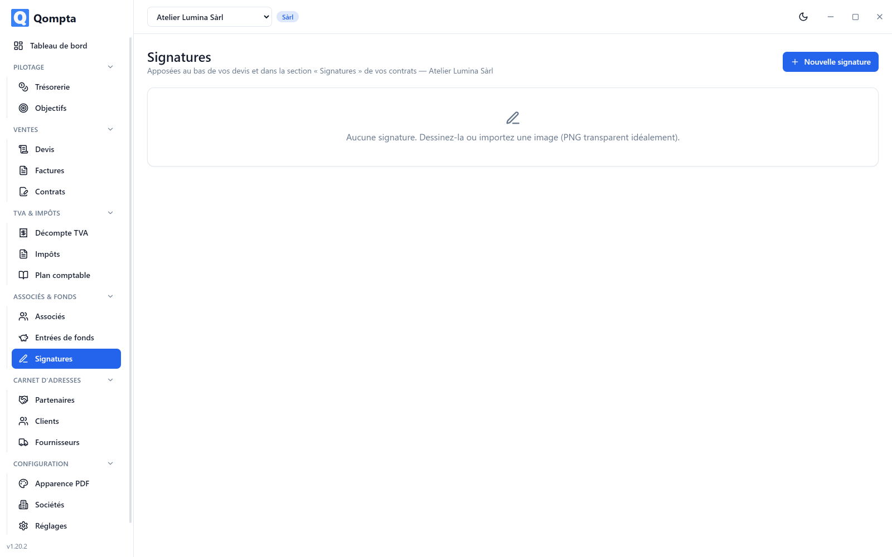

Une signature est une image, associée à un nom et à une fonction, réutilisable sur les
devis et les contrats.

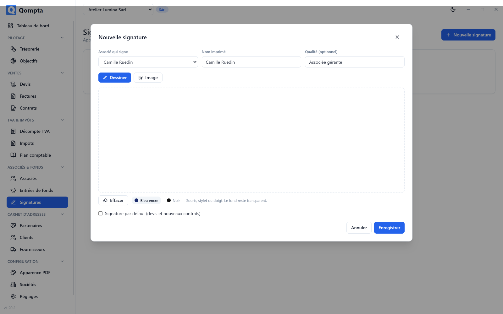

Une signature peut être marquée **par défaut** : elle est alors proposée
automatiquement sur les nouveaux devis. Un devis peut aussi n'en porter **aucune**, et
laisser une ligne vierge à signer à la main.

---

## 12. Les tableaux de bord

Le tableau de bord est l'écran par défaut. Chaque société peut en tenir **plusieurs**,
sous forme d'onglets, créés depuis des modèles au bouton **+** : vue d'ensemble,
finances, commercial, rentabilité, clients & pipeline, encaissement & créances.

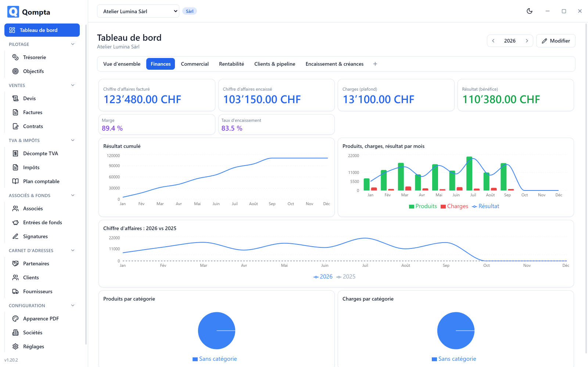

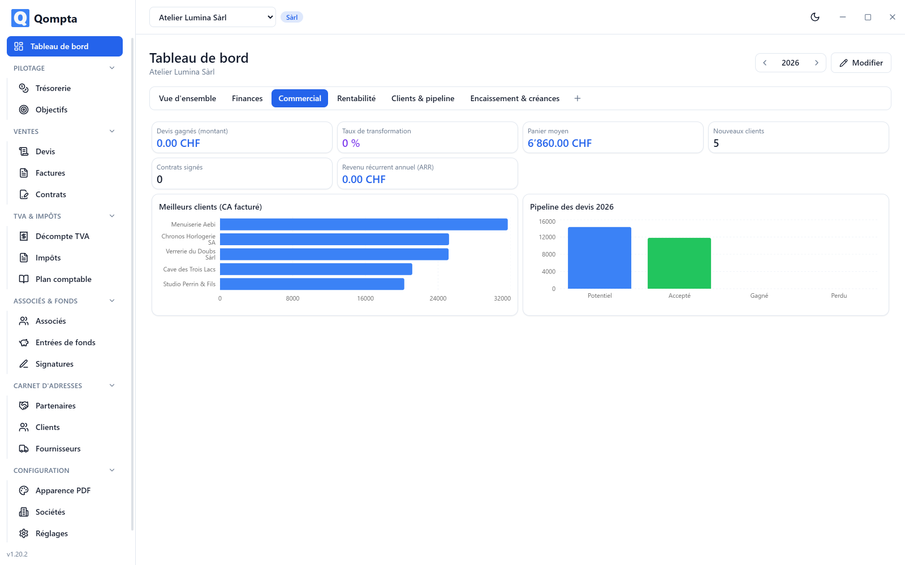

### Réorganiser

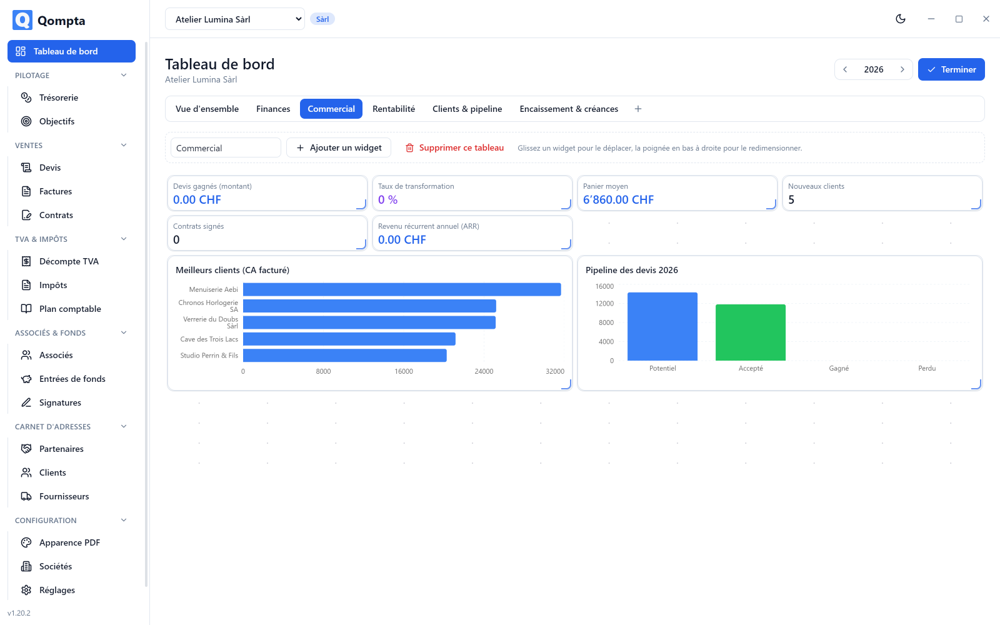

Le bouton **« Modifier »** fait apparaître la grille. Chaque widget se **déplace** et se
**redimensionne** librement, et refuse de chevaucher un autre : il ne va que sur de la
place libre.

Les widgets s'adaptent à la place qu'on leur donne : un indicateur réduit au minimum
n'affiche plus que son chiffre, et la taille du texte grandit avec la case.

Un widget est soit un **indicateur** (22 métriques disponibles), soit un **graphique** :
un du catalogue, ou un graphique sur mesure dont vous choisissez le type (barres, ligne,
camembert), la dimension (mois, catégorie, client, étape) et la valeur.

---

## 13. Les objectifs

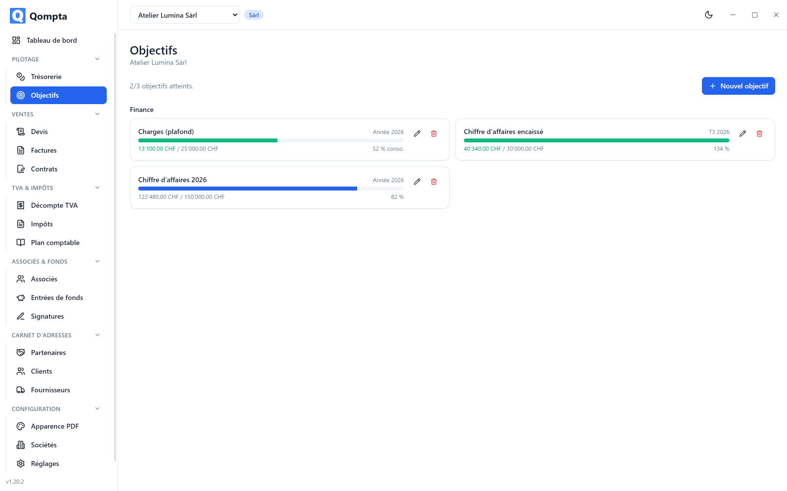

Un objectif porte sur une métrique, pour une période (année, trimestre ou mois), avec
un sens : **atteindre au moins** (un plancher : chiffre d'affaires, marge) ou **rester
en dessous** (un plafond : charges).

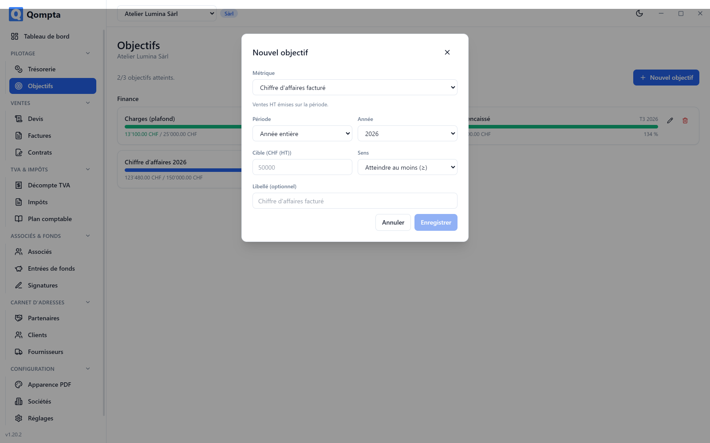

L'avancement n'est **jamais stocké**. Il est recalculé depuis les données à chaque
affichage, si bien qu'un objectif ne peut pas dériver de la comptabilité qu'il mesure.

---

## 14. L'apparence des documents

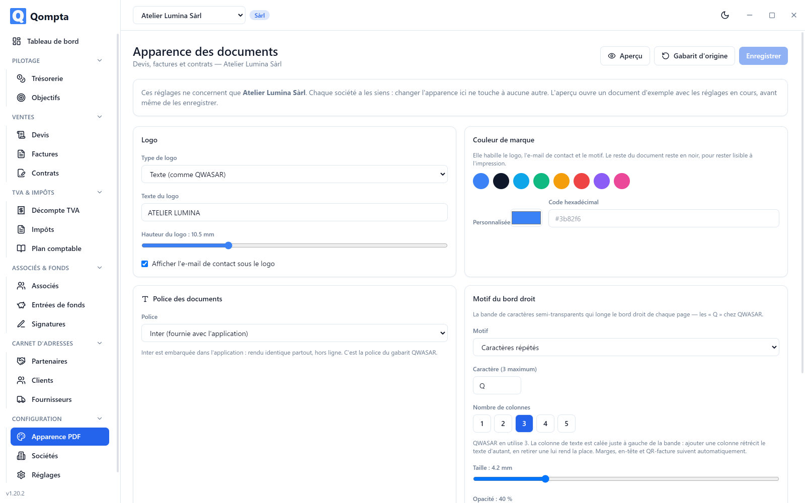

Chaque société a sa propre apparence de documents :

- **Logo** : un texte, une image importée, ou aucun, avec sa hauteur ;
- **Couleur de marque** ;
- **Motif du bord droit** : le caractère, de 1 à 5 colonnes, sa taille, son opacité, ou
  rien du tout. Les marges, l'en-tête et la QR-facture se recalent automatiquement sur
  la largeur de la bande ;
- **Ligne de contact** et **blocs de signature** ;
- **Police** : Inter (fournie, par défaut), un fichier que vous importez (.ttf, .otf,
  .woff2, stocké en base, donc emporté par les sauvegardes et imprimé même hors ligne),
  ou une police installée sur le poste.

Les valeurs par défaut reproduisent le gabarit d'origine à l'identique : une société qui
n'ouvre jamais cet écran garde le rendu historique.

L'**aperçu** rend un document d'exemple avec les réglages **non encore enregistrés** :
vous voyez avant de valider.

---

## 15. Plusieurs sociétés

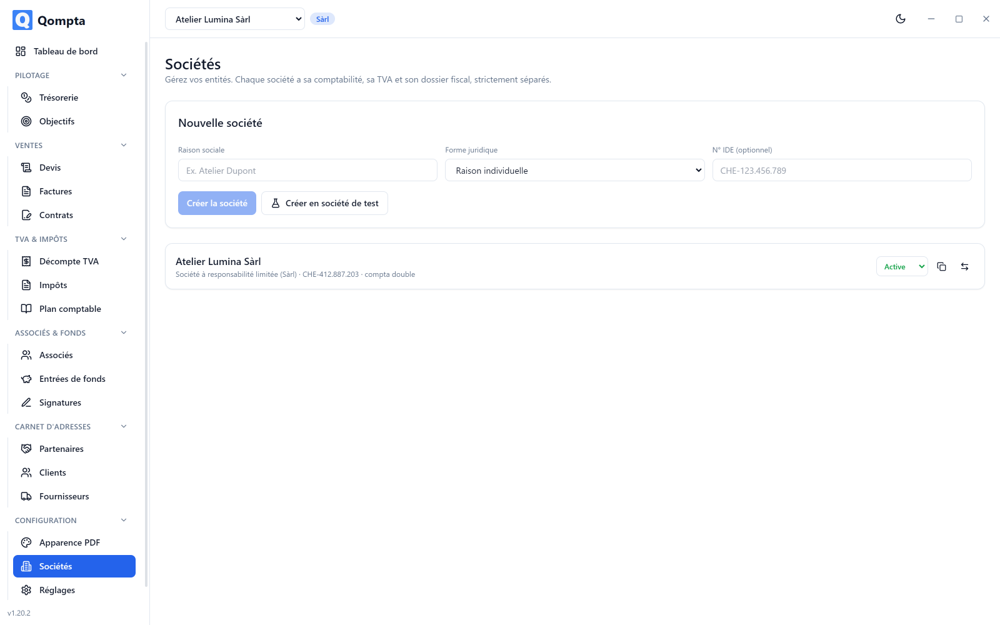

Le sélecteur en haut de la fenêtre passe d'une société à l'autre. Tout ce que vous voyez
ensuite appartient à la société sélectionnée : les données sont **strictement
cloisonnées**, et ce cloisonnement est vérifié par des tests automatisés, pas seulement
par convention.

La **duplication** reprend la structure d'une société (plan comptable, réglages TVA,
apparence) sans ses écritures. Pratique pour ouvrir une deuxième entité sur le même
modèle.

Une société peut aussi être rendue **inactive** : elle disparaît du sélecteur sans que
rien ne soit perdu.

---

## 16. Réglages et sauvegardes

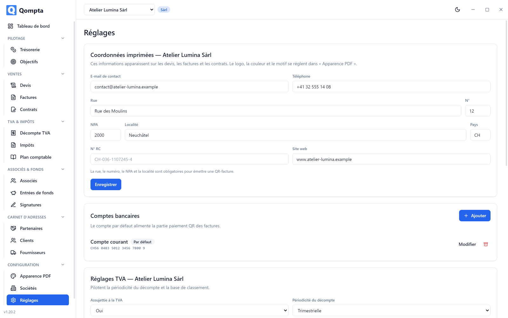

On y trouve le dossier des sauvegardes automatiques et leur durée de conservation, la
restauration, et l'export.

- **Restaurer une sauvegarde** remplace les données en place. L'ancienne base est mise
  de côté, pas supprimée.
- **Exporter des sociétés** écrit un fichier `.qexp` contenant les sociétés choisies, à
  réimporter ailleurs. C'est le bon outil pour déplacer une société sans déplacer tout
  le reste.
- **Export Excel** sort les données pour les retravailler dans un tableur.

Pour déménager toute l'installation, emportez une sauvegarde `.qbak` **et** votre clé de
récupération, séparément.

---

## 17. Rien n'est irréversible

Qompta n'a **aucune boîte de dialogue bloquante**. À la place, une barre d'action en bas
de l'écran :

- **les suppressions attendent 5 secondes** avant de s'appliquer, avec un compte à
  rebours visible : « Annuler » renonce, la croix applique tout de suite ;
- **les modifications s'annulent après coup**, rejouées à l'envers depuis un journal
  tenu par l'application ;
- **fermer un formulaire commencé** le garde de côté et propose « Reprendre » pendant
  15 secondes.

C'est vrai partout : supprimer un tiers, convertir un devis, changer la forme juridique
d'une société. Vous pouvez essayer sans crainte, et pour les essais à blanc, créez une
**société de test**, la seule qui se supprime définitivement.
