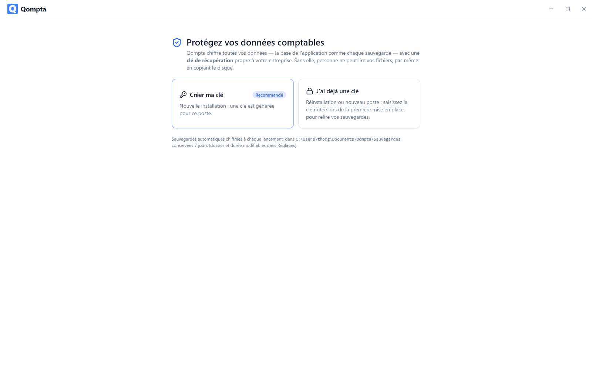
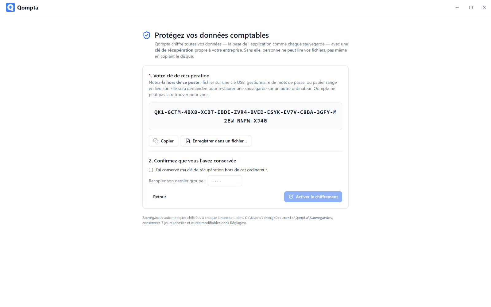
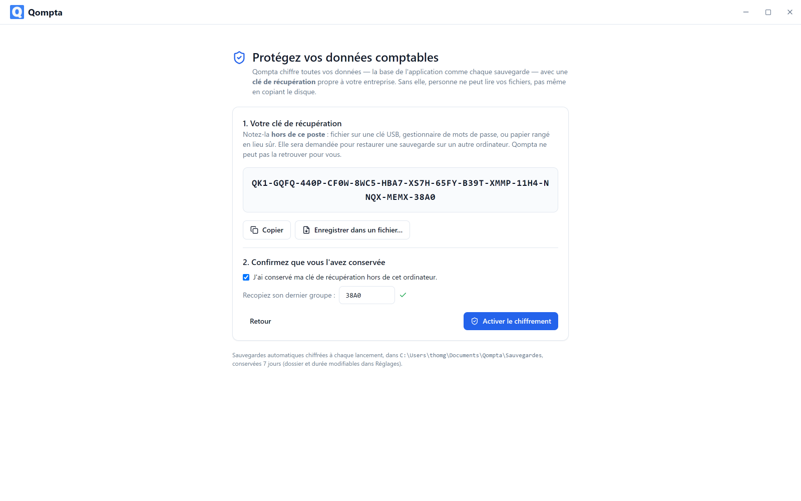
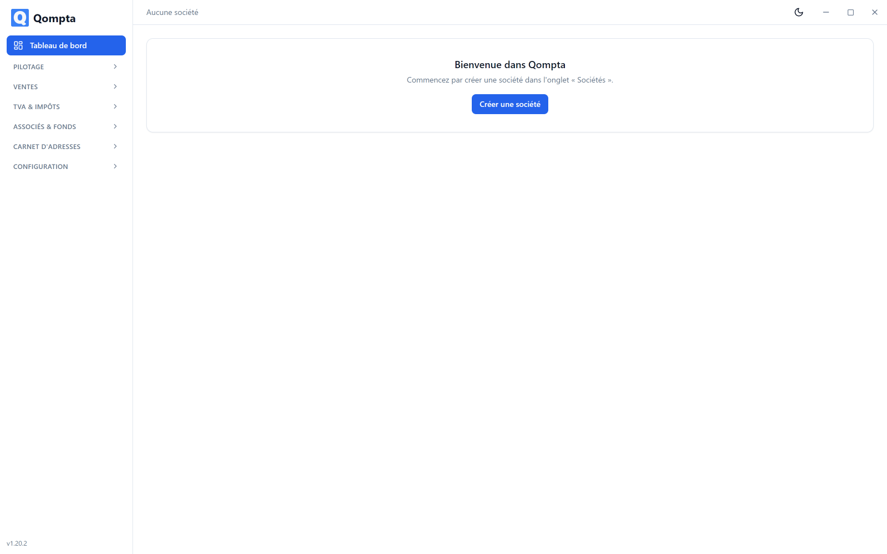
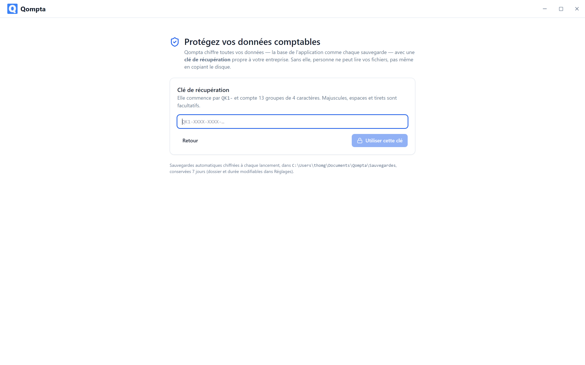

# Installer Qompta

Qompta fonctionne entièrement sur votre ordinateur. Aucun compte à créer, aucun
serveur à joindre, rien à configurer avant de commencer.

- [1. Télécharger](#1-télécharger)
- [2. Windows](#2-windows)
- [3. Linux](#3-linux)
- [4. Premier démarrage : la clé de récupération](#4-premier-démarrage--la-clé-de-récupération)
- [4 bis. Mot de passe de connexion et Windows Hello](#4-bis-mot-de-passe-de-connexion-et-windows-hello)
- [5. Sur un deuxième ordinateur](#5-sur-un-deuxième-ordinateur)
- [6. Sauvegardes](#6-sauvegardes)
- [7. Mettre à jour](#7-mettre-à-jour)
- [8. Désinstaller](#8-désinstaller)
- [9. Dépannage](#9-dépannage)

---

## 1. Télécharger

Chaque version publie ses paquets sur la
[page des releases](https://github.com/aekainal/qompta/releases/latest).

| Fichier | Pour |
|---|---|
| `Qompta-<version>-setup.exe` | Windows 10 et 11, 64 bits |
| `Qompta-<version>.deb` | Debian, Ubuntu et dérivées, 64 bits |
| `Qompta-<version>.AppImage` | Toute autre distribution Linux |

---

## 2. Windows

1. Lancez `Qompta-<version>-setup.exe`.
2. **Windows SmartScreen affiche un avertissement.** L'installeur n'est pas signé par
   un certificat commercial, car ceux-ci coûtent plusieurs centaines de francs par an.
   Cliquez sur **Informations complémentaires**, puis **Exécuter quand même**.
3. L'installeur vous demande où installer. Il **n'exige aucun droit administrateur**
   et installe pour votre compte utilisateur uniquement.

Qompta démarre ensuite tout seul et ajoute un raccourci au menu Démarrer et sur le
bureau.

### Où vivent vos données

| Quoi | Où |
|---|---|
| Base chiffrée | `%APPDATA%\Qompta\qompta.qdb` |
| Trousseau de connexion | `%APPDATA%\Qompta\qompta.keyring` (clé protégée par votre mot de passe et par Windows DPAPI) |
| Sauvegardes automatiques | `Documents\Qompta\Sauvegardes` |

---

## 3. Linux

### Debian, Ubuntu, Mint…

```bash
sudo apt install ./Qompta-<version>.deb
```

Utilisez `apt`, pas `dpkg -i` : `apt` installe au passage les bibliothèques dont
Electron a besoin. Si vous avez utilisé `dpkg` et que l'installation s'est arrêtée en
chemin, terminez-la par :

```bash
sudo apt-get install -f
```

Lancez ensuite Qompta depuis votre menu d'applications ou par `qompta` dans un
terminal.

### Autres distributions

L'AppImage ne s'installe pas et ne demande pas les droits root :

```bash
chmod +x Qompta-<version>.AppImage
./Qompta-<version>.AppImage
```

Si la fenêtre ne s'ouvre pas, il vous manque les bibliothèques système d'Electron :

```bash
sudo apt-get install -y libnss3 libnspr4 libasound2 libgtk-3-0 libgbm1
```

### Où vivent vos données

| Quoi | Où |
|---|---|
| Base chiffrée | `~/.config/Qompta/qompta.qdb` |
| Trousseau de connexion | `~/.config/Qompta/qompta.keyring` (clé protégée par votre mot de passe) |
| Sauvegardes automatiques | `~/Documents/Qompta/Sauvegardes` |

---

## 4. Premier démarrage : la clé de récupération

Au tout premier lancement, Qompta vous explique qu'il chiffre l'intégralité de vos
données et vous propose deux voies.



Choisissez **« Créer ma clé »** : une clé est générée pour ce poste.

### La clé s'affiche une seule fois



Elle se présente ainsi :

```
QK1-VKCW-J87C-Y4RX-JWTM-2QP2-9FQT-KK6W-ZACR-300M-C9PE-H7BP-6H0Y-J450
```

Deux boutons vous aident : **« Copier »** la met dans le presse-papiers,
**« Enregistrer dans un fichier… »** l'écrit où vous voulez.

> ### ⚠️ Notez cette clé ailleurs que sur cet ordinateur
>
> Un gestionnaire de mots de passe, une clé USB ou du papier rangé en lieu sûr.
>
> C'est le **seul** moyen de rouvrir vos données si la machine tombe en panne, si
> Windows est réinstallé ou si le coffre du système est réinitialisé.
> **Personne ne peut la régénérer** : ni vous, ni l'auteur du logiciel. La perdre,
> c'est perdre toute votre comptabilité et toutes vos sauvegardes.

### Confirmer que vous l'avez conservée



Cochez la case, puis **recopiez le dernier groupe** de la clé (`J450` dans l'exemple
ci-dessus). Cette étape existe exprès : c'est la seule preuve que la clé a bien quitté
l'écran.

### Choisir le mot de passe de connexion

Troisième étape : le mot de passe demandé à chaque ouverture de Qompta (voir la section
suivante). Le bouton **« Activer le chiffrement »** ne s'active qu'une fois la clé
confirmée et le mot de passe valide.

Qompta redémarre alors sur l'application, prête à l'emploi.



### Ce qui est chiffré, exactement

Tout. La base ne touche jamais le disque en clair : elle est déchiffrée en mémoire au
démarrage et seul un fichier scellé en AES-256-GCM est réécrit. Les sauvegardes
automatiques sont chiffrées avec la même clé. Copier le disque ou le dossier de
sauvegardes, ne donne rien sans la clé.

---

## 4 bis. Mot de passe de connexion et Windows Hello

Depuis la version 1.21.0, Qompta ne s'ouvre plus sans vous : un **mot de passe de
connexion** est demandé à chaque lancement. Chiffrer le disque ne sert à rien si
n'importe qui peut ouvrir l'application sur votre session.

Le mot de passe compte **au moins 10 caractères**, avec au moins une lettre, un chiffre
et un caractère spécial (`!`, `@`, `#`, `-`, `.`…). La liste des règles se coche
en direct pendant la saisie.

**Windows Hello** (Windows uniquement) : si votre poste le propose (visage, empreinte,
code PIN), Qompta offre de l'utiliser en plus du mot de passe. Il se présente alors dès
l'ouverture ; le mot de passe reste toujours accepté. Il s'active ou se désactive dans
**Réglages → Connexion** où l'on change aussi le mot de passe (l'actuel est demandé).
Sous Linux et macOS, la connexion se fait par mot de passe.

**Mot de passe oublié ?** Le lien de l'écran de connexion demande la **clé de
récupération**, puis un nouveau mot de passe. C'est le seul moyen de le remplacer : ni
l'application ni l'auteur du logiciel ne peuvent le faire autrement. Vos données, elles,
ne changent pas.

**Mise à jour depuis une version 1.20 :** au premier lancement, Qompta vous demande de
choisir ce mot de passe, une seule fois. Votre clé de récupération reste la même et
vos sauvegardes s'ouvrent comme avant.

Afficher la clé de récupération dans **Réglages** demande aussi le mot de passe.

---

## 5. Sur un deuxième ordinateur

Installez Qompta normalement, puis choisissez **« J'ai déjà une clé »** au premier
démarrage. Le mot de passe de connexion est propre à chaque poste : choisissez-le à
cette étape.



Saisissez la clé notée lors de la première mise en place. Les tirets et la casse n'ont
pas d'importance. Vos sauvegardes s'ouvrent alors comme sur le poste d'origine.

---

## 6. Sauvegardes

Qompta écrit une sauvegarde chiffrée **à chaque lancement**, dans
`Documents\Qompta\Sauvegardes` et les conserve 7 jours. Le dossier et la durée se
changent dans **Réglages**.


Comme les sauvegardes sont chiffrées avec votre clé, **une sauvegarde seule ne suffit
pas** pour récupérer : il vous faut la sauvegarde *et* la clé de récupération.
Conservez-les à deux endroits différents.

Pour restaurer : **Réglages → Restaurer une sauvegarde**. La restauration remplace les
données en place, donc Qompta met l'ancienne base de côté au lieu de la supprimer.

Si un jour vous devez lire une sauvegarde hors de l'application, le script
`scripts/decrypt-backup.mjs` du dépôt le fait avec Node et votre clé, sans rien
d'autre.

---

## 7. Mettre à jour

Installez la nouvelle version par-dessus l'ancienne : même installeur, mêmes étapes.
Vos données, votre clé et vos sauvegardes ne sont pas touchées : elles vivent en dehors
du dossier du programme.

Les migrations de base s'appliquent seules au démarrage et sont testées pour conserver
chaque ligne existante.

---

## 8. Désinstaller

- **Windows** : Paramètres → Applications → Qompta → Désinstaller.
- **Debian/Ubuntu** : `sudo apt remove qompta`.

Ni l'un ni l'autre n'efface vos données. Pour les supprimer aussi, effacez le dossier
de données indiqué plus haut et votre dossier de sauvegardes, en étant sûr de ne plus
en avoir besoin, car sans ces fichiers la clé de récupération seule ne restaure rien.

---

## 9. Dépannage

**L'application ne démarre plus après une mise à jour (Windows).**
Presque toujours le module natif de base de données resté dans la mauvaise variante.
Réinstallez le paquet publié plutôt qu'une version construite à la main.

**« Clé de récupération invalide » à la saisie.**
Les groupes sont lus sans leurs tirets et sans distinction de casse, mais un caractère
faux reste un caractère faux. Vérifiez les `0`/`O` et les `1`/`I` : l'alphabet employé
(base32 Crockford) exclut justement les caractères ambigus, donc une erreur de saisie
en est vraiment une.

**Linux : la fenêtre reste noire ou ne s'ouvre pas.**
Bibliothèques système manquantes : voyez la commande de la section 3. Sous WSLg, même
remède.

**J'ai perdu ma clé de récupération.**
Il n'y a pas de solution. C'est le prix du chiffrement : si une porte de secours
existait, elle existerait aussi pour quelqu'un d'autre. Tant que l'application s'ouvre
encore sur ce poste (avec votre mot de passe), la clé est toujours dans son trousseau :
affichez-la dans **Réglages**, notez-la et faites une sauvegarde immédiatement.

**J'ai oublié mon mot de passe.**
**« Mot de passe oublié ? »** sur l'écran de connexion, puis la clé de récupération et un
nouveau mot de passe. Sans la clé, il n'y a pas de solution, pour la même raison.
